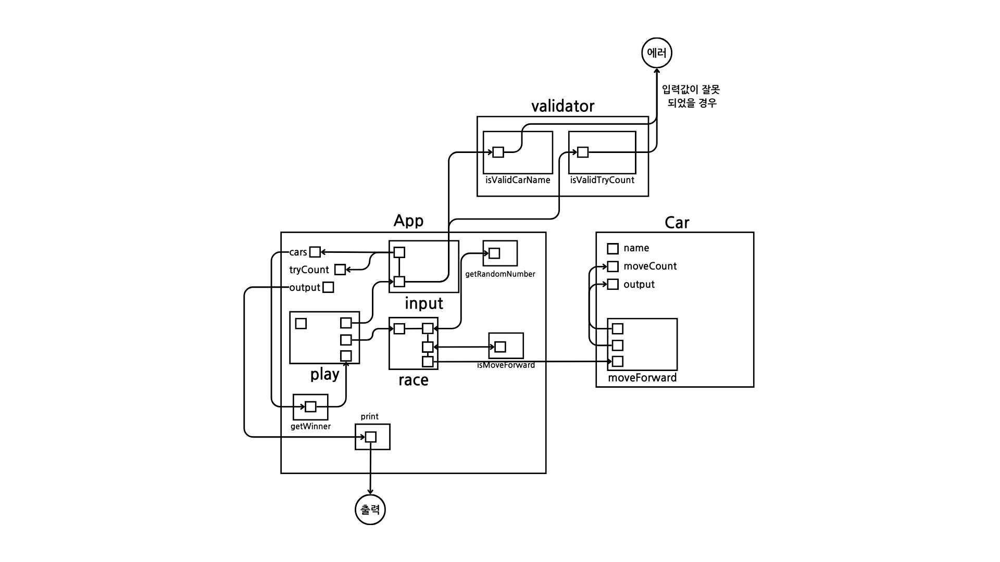

## 요구사항 분석

### 기능 요구 사항

-   주어진 횟수 동안 n대의 자동차는 전진 또는 멈출 수 있다.
-   0~9 사이에서 무작위 값을 구한 후 무작위 값이 4 이상인 경우 전진.
-   게임이 완료되면 누가 우승했는지 출력한다.
-   우승자가 여러 명일 경우 쉽표(,)로 구분한다.
-   사용자가 잘못된 값을 입력한 경우 throw 문을 사용해 "[ERROR]"로 시작하는 메시지를 가지는 예외를 발생시킨 후 애플리케이션은 종료되어야 한다.
    ```
    예시) [ERROR] 숫자가 잘못된 형식입니다.
    ```
-   (명시되어있지 않음) 각각의 자동차는 매 차수마다 각각의 무작위 값을 얻는다.

### 프로그래밍 요구 사항

-   깊이가 3이 넘지 않도록 구현한다.
    -   예를 들어 while문 안에 if문이 있으면 깊이는 2이다.
-   Jest를 이용하여 본인이 정리한 기능 목록이 정상 동작함을 테스트 코드로 확인한다.
    -   테스트 도구가 익숙하지 않다면 `__tests__/StringTest.js` 를 참고하면 된다.

## 기능

### 입력

-   [x] N개의 자동차 이름 입력(이름은 쉼표 기준으로 구분)
-   [x] 각각의 자동차 이름을 갖는 객체 생성
-   [x] 시도할 횟수 입력

### 유효성 검사

-   [x] 각각의 입력값마다 유효성 검사
    -   [x] 자동차 이름은 5자 이하만 가능하다.
    -   [x] (명시되어 있지 않음) 자동차 이름은 공백으로 시작하거나 끝날 수 없다.
    -   [x] (명시되어 있지 않음) 자동차 이름은 중복되지 않아야 한다.
    -   [x] 시도할 횟수는 숫자여야 한다.
    -   [x] (명시되어 있지 않음) 시도할 횟수는 0보다 크고 10보다 작아야 한다.(범위 설정)

### 메인 로직

-   [x] 무작위 값 추출
-   [x] 전진 여부 확인
-   [x] 전진
    -   [x] 전진 횟수 카운트
    -   [x] '-' 문자 추가
-   [x] 최종 우승자 구하기

### 출력

-   [x] 실행 결과 출력
-   [x] 최종 우승자 출력

## 설계도


